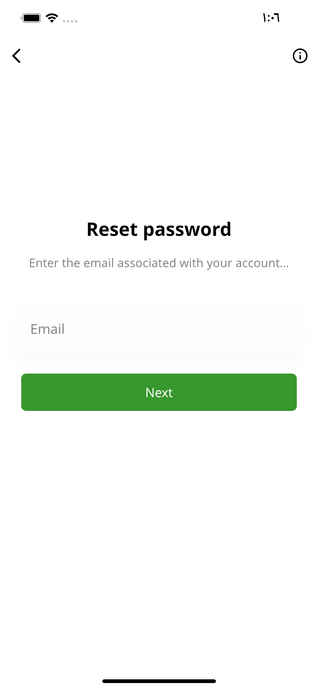
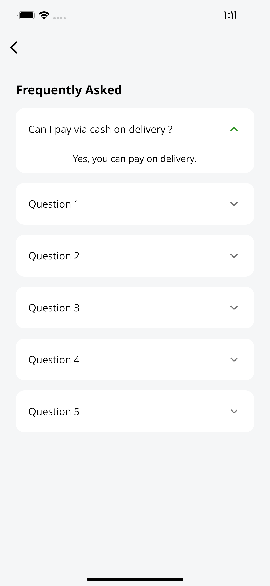

# Shop Mobile

https://www.figma.com/file/pgZhGkpSWwrkUqMoEYfPq0/Mobile-shop-App-UI-Kit?node-id=214%3A2546

## Features

+ PROVIDER,
+ GET_IT,
+ RX_DART,
+ DIO,
+ INTERCEPTORS,
+ OFFLINE,

+ ONBOARDING,
+ REGISTRATION,
+ HOME,
+ SEARCH,
+ NOFIFICATIONS,
+ CATEGOREY,
+ CART,
+ EXEPLOR,
+ FAVOURITE,
+ PROFILE,
+ CHANGE PASSWORD,
+ SETTING,
+ LANGUAGES,
+ MY PURCHES,
+ -TRAKING,

  

  

  

  
  ⚫
   
  ⚫
  
  

  
  ⚫
   

  
  ⚫
   
  ⚫
  

  
  ⚫
   
  ⚫
  

  
  ⚫
   
  ⚫
  

  
  ⚫
   
  ⚫
   

  
  ⚫
   
  ⚫
  

  
  ⚫
   
  ⚫
  

  
  ⚫
   
  ⚫
   ⚫
   ⚫
  

  
  ⚫
   
  ⚫
   ⚫
   ⚫
  

  
  ⚫

